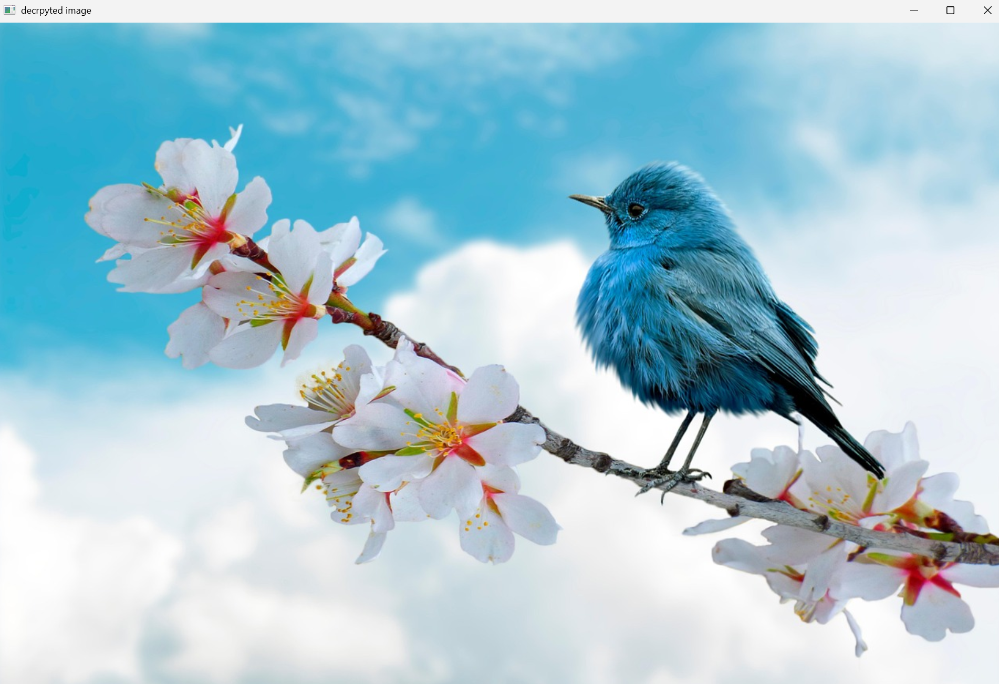

# Image Encryption & Compression System

A Python-based image processing project that implements dual-layer encryption (Bitwise XOR + Matrix Permutation) alongside spatial reduction algorithms for efficient, secure data transmission.



## 📌 Overview
This project explores the intersection of security and bandwidth efficiency. It allows for encrypting images while simultaneously reducing their size using neighbor-averaging techniques. This simulates a real-world scenario where a sender transmits a lightweight, secure payload to a server, and the client reconstructs (decrypts and upscales) the image locally.

## 🚀 Key Features

### 1. Dual-Layer Security
* **Bitwise XOR:** Masks pixel values using a randomly generated key.
* **Matrix Permutation:** Shuffles pixel positions based on a random index map, adding a second layer of confusion.

### 2. Image Reduction (Compression)
* **4N Method (4-Neighbor):** Averages 2x2 pixel blocks, reducing image dimensions by 50%.
* **8N Method (8-Neighbor):** Averages 3x3 pixel blocks, reducing image dimensions by ~66% (1/3rd size).

### 3. Restoration & Upgrade
* **Smart Decryption:** Reverses the permutation and XOR operations.
* **Upscaling:** Expands the reduced image back to its original resolution using a block-fill approach.

## 🛠️ Dependencies
* **Numpy:** 
* **OpenCV:**

## 💻 Usage

### 1. Basic Encryption (No Reduction)
Use the base class to encrypt the image with XOR and Permutation (shuffling).

```python
import cv2
from image_cipher import ImageCipher

# Load image
img = cv2.imread('image.jpg')

# Initialize with Permutation enabled
cipher = ImageCipher(img, permutate=True)

# Encrypt
encrypted = cipher.encrypt_image()

# Decrypt
decrypted = cipher.decrypt_image(encrypted)
```

### 2. Encryption with Reduction (4N or 8N)
Use the subclass to compress the image size before encryption.

```python
from image_cipher import ReducedCipher

# Initialize with '8N' (High compression)
reducer = ReducedCipher(img, method='8N')

# Encrypt the reduced version
enc_reduced = reducer.encrypt_reduced()

# Decrypt and Upscale back to original size
restored = reducer.decrypt_upgrade(enc_reduced)
```
